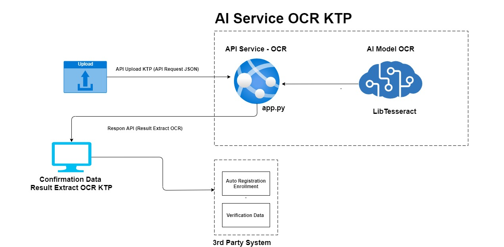
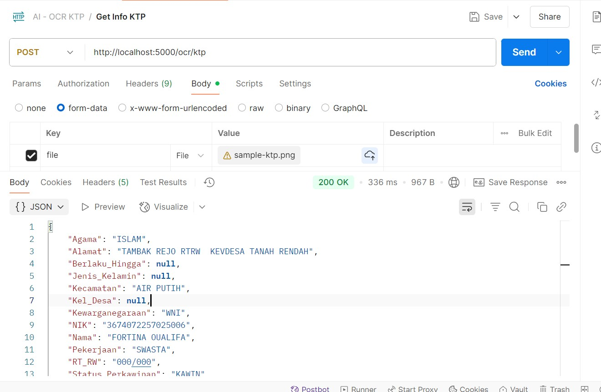

# Automatic Registration or Verication Using OCR KTP

Automating registration and data verification processes using the power of Artificial Intelligence, specifically Optical Character Recognition (OCR). In many business scenarios today, customer onboarding often involves manual data entry from identity documents like ID cards (KTPs), which is time-consuming and prone to errors. This solution aims to address these challenges.

This project introduces an "AI Service for KTP OCR" designed to automatically extract key information from KTP images, thereby speeding up the registration process and improving data accuracy. Let's dive deeper into its architecture.

## Architecture Overview



From the diagram above, you can see the main components that make up this system:

1.  **Upload Module:** This is the starting point of the workflow. Users can upload KTP images through this interface. The uploaded KTP image is then sent to the AI Service as an API request in JSON format.

2.  **AI Service KTP OCR:** This is the core of our data extraction system. It consists of two main parts:

      * **API Service - OCR (`app.py`):** This is the API endpoint that receives JSON requests containing the uploaded KTP image. Its job is to manage the request, process the image, pass it to the OCR model, and then return the text extraction results as a JSON response.
      * **AI Model OCR (LibTesseract):** This is the actual character recognition engine. In this architecture, we leverage `LibTesseract`, a powerful open-source OCR library, to perform the text extraction process from KTP images. This model is responsible for converting image pixels into machine-readable text.

3.  **Confirmation Data Result Extract OCR KTP:** After the AI Service successfully extracts data from the KTP, these results are sent back to the confirmation module. Here, users or operators can review and confirm the extracted data to ensure its accuracy before proceeding to the next step.

4.  **3rd Party System:** The confirmed data can then be integrated with third-party systems for various purposes:

      * **Auto Registration Enrollment:** The extracted data can be used to automatically fill out registration forms, accelerating the onboarding process for new customers.
      * **Verification Data:** The extracted information can also be used to verify customer data against external databases or other internal systems for KYC (Know Your Customer) purposes or fraud prevention.

## How It Works

The workflow is quite straightforward and efficient:

1.  A user uploads a KTP image through the upload interface.
2.  The KTP image is sent as a JSON API request to the `API Service - OCR` (`app.py`).
3.  `app.py` processes the image and passes it to the `AI Model OCR` (using `LibTesseract`).
4.  `LibTesseract` performs OCR on the KTP image, extracting text such as name, NIK (ID number), address, etc.
5.  The extracted text results are sent back to `app.py`.
6.  `app.py` returns the extracted results (in JSON format) as an API response to the `Confirmation Data Result Extract OCR KTP` module.
7.  The user confirms the data.
8.  The confirmed data is then used by the `3rd Party System` for auto-registration or data verification.

## Installation and Setup

Before running the `app.py` service, you'll need to install Tesseract OCR and its Python bindings.

First, update your package list and install Tesseract OCR:

```bash
sudo apt update
sudo apt install tesseract-ocr
sudo apt install libtesseract-dev # This is important for Python binding
```

Next, install the Indonesian language data pack for Tesseract, which is crucial for recognizing Indonesian text from KTPs:

```bash
sudo apt update
sudo apt install tesseract-ocr-ind
```

Finally, you'll need to install the `pytesseract` Python library and Flask:

```bash
pip install pytesseract Flask Pillow
```

## Explore the Code

### Sample KTP File


### Sample KTP File

For demonstration purposes, here's an example KTP that can be used as input. This is an image file that will upload via API.


### Testing the API with Postman

Here are screenshots of testing the `ocr_ktp` API using Postman. Notice the JSON request body containing the base64-encoded KTP image, and the response containing the extracted data.

**Postman Request & Respon:**


